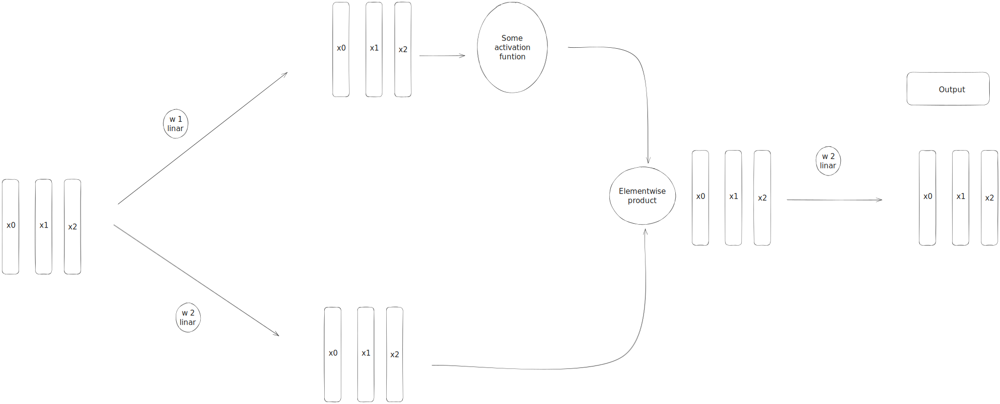

# GLU Variants Improve Transformer


Paper: https://arxiv.org/abs/2002.05202v1



take input x and pass it though 2 linear layer creating x1 and x2.<br>
pass x1 though activation, multiplay x1*x2 = x3 now pass x3 though activation

$$
\text{FFN}_{\text{GLU}}(x, W_1, W_2, W_3) = (\sigma(xW_1) \odot xW_2)W_3
$$

```python
class GLU(nn.Module):
    def __init__(
        self,
        dim: int,
        hidden_dim: int = None,
        multiple_of: int = 4,
        dropout: float = None,
        activation:Callable=None,
        bias: bool = False,
    ):
        super().__init__()

        self.w1 = nn.Linear(dim, hidden_dim, bias=bias)
        self.w2 = nn.Linear(hidden_dim, dim, bias=bias)
        self.w3 = nn.Linear(dim, hidden_dim, bias=bias)
        self.activation  = activation if activation else F.silu 
        self.dropout = nn.Dropout(dropout)

    def forward(self, x):
        
        x1 =  self.w1(x)
        x2 = self.w2(x)

        x1 = self.activation(x1)

        return self.dropout(self.w3(x1 * x2))

```

## Long explain
$$
x1 = W1 \cdot x \\
x2 = W2 \cdot x \newline \\ \newline

x'1 =  f(x1) \\
\quad \text{where } f \scriptsize { can \ be\ ReLU, SiLU,\ GELU...}
\\
x3 = x'1 \otimes x2 
\\
xout = w3 \cdot W3
$$

