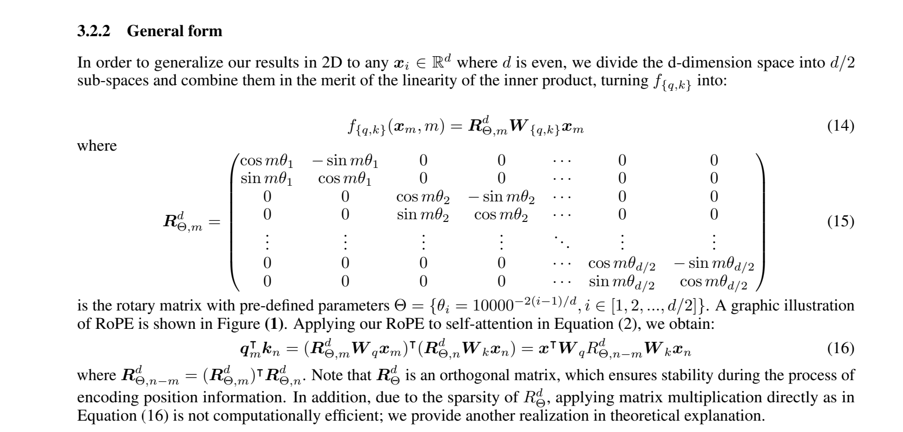

# RoFormer

Name:"RoFormer: Enhanced Transformer with Rotary Position Embedding"

Source: https://arxiv.org/abs/2104.09864

---


### What's new rotatry embedding 


Make block of two apply rotary rotation matrix on it.
[[dot product]] between two vector signify relative distance 

```python
def apply_rope(k,q,freqs_sin,freqs_cos):
    # Idea suppose vector v = [x,y,x1,y1,...] # v.shape = dim 
    # convert vetor into complex num # ie two vec one real, one imagery 
    # [x,y,x1,y1,...] -> x+iy, x1+iy1
    # Multiplying by complex num == roatate vector
    # => (x + iy) * (cos + isin) -> x'+iy'
    # restack
    # x'+iy' -> [x',y',x1',y1'...]
    # you roated vector in chunks of two lfg!!!
    
    #  rehsape a shape (...,n )-> (..., n//2,2)
    q_cis = q.float().reshape(q.shape[:-1] + (-1, 2)) # (B,T,nhead,C) -> (B,T,nhead,Cc,2) # Cc = C//2
    k_cis = k.float().reshape(k.shape[:-1] + (-1, 2)) # (B,T,nhead,C) -> (B,T,nhead,Cc,2) 
    
    xq_r, xq_i = q_cis.unbind(-1) # (B,T,nhead,Cc,2) -> ((B,T,Cc), (B,T,Cc)) split into two tuple
    xk_r, xk_i = k_cis.unbind(-1) # (B,T,nhead,Cc,2) -> ((B,T,Cc), (B,T,Cc))
    
    freqs_cos = reshape_for_broadcast(freqs_cos,xq_r) # freqs.shape = (1,T,1,Cc)
    freqs_sin = reshape_for_broadcast(freqs_cos,xq_r)
    
    
    # e+if = (a+ib) * (c+di) = (ac-bd) + i (ad+bc) 
    # a = xq_r , b = xq_i 
    # c = fcos , d = fsin
    # ... 
    # e = (ac-bd) = xq_r * freqs_cos - xq_i * freqs_sin
    # f = (c+di)  = xq_r * freqs_sin + xq_i * freqs_cos
    
    xq_out_r = xq_r * freqs_cos - xq_i * freqs_sin # (ac-bd)   # shape =  # (B,T,nhead,Cc)
    xq_out_i = xq_r * freqs_sin + xq_i * freqs_cos # (ad+bc) * i
    xk_out_r = xk_r * freqs_cos - xk_i * freqs_sin # (ac-bd) 
    xk_out_i = xk_r * freqs_sin + xk_i * freqs_cos # (ad+bc) * i
    
    # now we stack r,i -> [r,i,r2,i2]
    xq_out = torch.stack([xq_out_r, xq_out_i], dim=-1)  # (B,T,nhead,Cc,2)
    xk_out = torch.stack([xk_out_r, xk_out_i], dim=-1)  # (B,T,nhead,Cc,2)
    
    # flatten last two dimensions
    xq_out = xq_out.flatten(3) # (B,T,nhead,C) 
    xk_out = xk_out.flatten(3) # (B,T,nhead,C)
    
    return xq_out.type_as(xq), xk_out.type_as(xk)
```

```python
def reshape_for_broadcast(freqs_cis: torch.Tensor, x: torch.Tensor):
    ndim = x.dim()
    assert 1 < ndim
    assert freqs_cis.shape == (x.shape[1], x.shape[-1]), f"{freqs_cis.shape=}, {(x.shape[1], x.shape[-1])=}"
    
    # keep 2nd (T) and last(freq) dim same else make dim 1 for freq_cis
    shape = [d if i == 1 or i == ndim - 1 else 1 for i, d in enumerate(x.shape)] 
    # print(shape)
    return freqs_cis.view(shape)
```
# Breakdown

```python
def precompute_freqs_cis(dim: int, end: int, theta: float = 10000.0):
    freqs = 1.0 / (theta ** (torch.arange(0, dim, 2)[: (dim // 2)].float() / dim))
    t = torch.arange(end, device=freqs.device)  # type: ignore
    freqs = torch.outer(t, freqs).float()  # type: ignore
    freqs_cos = torch.cos(freqs)  # real part
    freqs_sin = torch.sin(freqs)  # imaginary part
    return freqs_cos, freqs_sin

```



$$

\Theta = \{\theta_{i} = 10000^{-2(i-1)/d}, i \in [1,2,\dots,d/2]\}


$$
```python
freqs = 1.0 / (theta ** (torch.arange(0, dim, 2)[: (dim // 2)].float() / dim))

# 2(i-1)/d =
# 2*torch.arange(0,dim//2) = torch.arange(0, dim, 2)
# [: (dim // 2)] trancation if odd num of dim
# x**-2 = 1/x**2
```